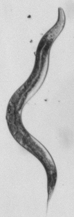

#### wormseg ####

A set of MATLAB routines for segmenting and skeletonizing time series of bright-field microscopy images of C. elegans.

The code was developed by the Brangwynne laboratory at Princeton University. If using this code please cite:

     W.Gilpin, S. Uppaluri, C. Brangwynne “Worms under pressure: 
     bulk mechanical properties of C. elegans are independent of the cuticle” 
     Biophysical Journal, 2015.

If using any portion of the skeletonization code recommended below (not included in this repository), please follow the license included in that work.

#### Usage ####

Download and install [N. Howe's "Better Skeletonization" handwriting recognition code](http://www.mathworks.com/matlabcentral/fileexchange/11123-better-skeletonization) from the MATLAB file exchange.(this code usually requires re-compiling on OSX)

Download this repository.

Place both repositories on your MATLAB search path. 

In this version of the code, the function "skeleton.m" from N. Howe's library is explictly called. Check to make sure that that function is working.

Run the individual code blocks separated by cells in the main_analysis.m code file.

Initial Image        |  Processed Image
:-------------------------:|:-------------------------:
	|	

